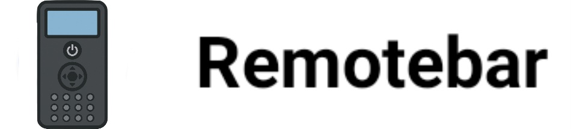

 

# Remotebar

Remotebar is a customizable remote control interface for Android devices, specifically designed for use with the Haptique RS90 remote control. It provides a clean and intuitive interface optimized for 3.1 inch LCD displays (480 x 800 pixels) and is compatible with Android 12 and 14.

## Features
* Start menu - shows you all applications installed on the device, configurable as a list or as a grid
* Recent apps tray - shows your most recently used apps and lets you easily switch between them
* Customizable menu position - place the menu at bottom center, top center, or corners of the screen
* Optimized for remote control navigation
* Collapsible and hideable - show it when you need it, hide it when you don't
* Many different configuration options - customize Remotebar however you want
* Pin favorite apps or block the ones you don't want to see
* 100% free, open source, and no ads

## Requirements
* Android 12 or 14
* Optimized for 3.1 inch LCD displays (480 x 800 pixels)
* Compatible with Haptique RS90 remote control

## Changelog
To see some of the major new features in the latest Remotebar release, visit the [changelog].

## Download
Remotebar can be downloaded as a standalone Android app from:

available soon!     

## How to Build
Prerequisites:
* Windows / MacOS / Linux
* JDK 8
* Android SDK
* Internet connection (to download dependencies)

Once all the prerequisites are met, make sure that the `ANDROID_HOME` environment variable is set to your Android SDK directory, then run `./gradlew assembleFreeDebug` at the base directory of the project to start the build. After the build completes, navigate to `app/build/outputs/apk/free/debug` where you will end up with an APK file ready to install on your Android device.

### Running tests

Remotebar uses [Robolectric](https://github.com/robolectric/robolectric) as its unit testing framework.  The entire test suite can be run with `./gradlew testFreeDebug`, or you can generate a Jacoco coverage report using `./gradlew jacocoTestFreeDebugUnitTestReport` which will be output to the `app/build/jacoco/jacocoHtml` directory.  If you contribute code improvements such as bug fixes, we recommend writing tests alongside it using Robolectric.

## For Third-Party App Developers

#### Android 10 Desktop Mode support via libtaskbar
The original Taskbar can be included as a library inside any third-party launcher, to quickly and easily add Android 10 Desktop Mode support into your existing launcher with no additional setup.

For more information on including Taskbar inside your application, see the [libtaskbar documentation](https://github.com/farmerbb/libtaskbar/blob/master/README.md).

#### Icon Pack Support
Remotebar includes support for ADW-style icon packs.  If you are an icon pack developer and would like to include support for applying the icon pack from within your app, simply use the following code:

    Intent intent = new Intent("openlewa.remotebar.APPLY_ICON_PACK");
    intent.putExtra("android.intent.extra.PACKAGE_NAME", "com.iconpack.name");
    startActivity(intent);

## Contributors 

Remotebar is a fork of Taskbar, originally developed by Braden Farmer and the Taskbar team. Full credit for the original project goes to them. This fork exists as a modified version and does not imply their direct involvement in this variant. Special thanks to the Taskbar team and Braden Farmer.

## Credits

This project is a fork of:

Taskbar
Copyright (C) Braden Farmer
https://github.com/farmerbb/Taskbar

Original contributors include:

Pull requests are welcome!  See the [contributor guidelines](https://github.com/farmerbb/Taskbar/blob/master/CONTRIBUTING.md) for more details.

* Mark Morilla (app logo)
* naofum (Japanese translation)
* HardSer (Russian translation)
* OfficialMITX (German translation)
* Whale Majida (Chinese translation)
* Mesut Han (Turkish translation)
* Zbigniew Zienko (Polish translation)
* utzcoz (Additional Chinese translation, code cleanup + unit testing)
* RaspberryPiFan (Additional German translation)
* Diego Sangunietti (Spanish translation)
* Tommy He (Chinese translation for Desktop Mode)
* Aaron Dewes (German translation updates)
* Ingo Brückl (German translation updates)

#### Special Thanks
* Mishaal Rahman (xda-developers)
* Jon West (Team Bliss)
* Chih-Wei Huang (Android-x86)
